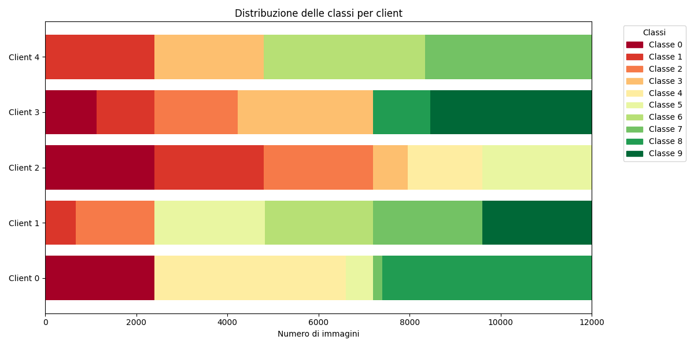

# federated-mnist

## Introduzione
Questo progetto simula un approccio di Federated Learning, utilizzando il dataset MNIST, contenente 60000 immagini 28x28 di cifre scritte a mano, insieme a 10000 immagini di test.  
L'obiettivo è quello di allenare una rete neurale a riconoscere le cifre, utilizzando i dati di training (60000 immagini), per poi testarla sui dati di test (10000 immagini).

L'approccio utilizzato è il Federated Learning, che permette un allenamento su dati decentralizzati, nel quale si condivide solo il modello, garantendo sicurezza e privacy.

## Come funziona
Una volta caricato il dataset e mescolato, viene distribuito tra N 'client' (prima 2, poi 5). Il dataset viene distribuito con un batch size di 32.
Successivamente viene creato un modello globale che simula quello del server.  
Questo viene passato ai vari client, i quali allenano il modello 'localmente' con il proprio sottoinsieme di dati.  
Infine i client restituiscono solo i pesi al server, che procederà con l'aggiornarnamento del modello globale.

Questo processo viene ripetuto per diversi round, migliorando progressivamente l'accuratezza del modello.

È importante sottolineare che non si tratta di un progetto con dei veri client e server. Si tratta di una simulazione, in cui la chiamata al Server si tratta semplicemente di una chiamata di funzione.

Per realizzare lo script ho seguito lo pseudo-codice fornito nell'articolo scientifico *Communication-Efficient Learning of Deep Networks from Decentralized Data*, a cura di H. Brendan McMahan, Eider Moore, Daniel Ramage, Seth Hampson, Blaise Aguera y Arcas (Google).  
L'articolo si pone l'obiettivo di dimostrare come l'approccio federato funzioni in maniera ottimale per l'allenamento di reti neurali, sottolineando le differenze con altri tipi di approcci.

Ho realizzato 2 versioni:
- una con un approccio IID, in cui il dataset viene distribuito in maniera uniforme tra i client
- una con un approccio non-IID, in cui il dataset viene diviso in shard, e ogni client ne riceve 2. Perciò ogni client vede solo una porzione del dataset (e quindi di classi). Questo fornisce una rappresentazione più realistica di come il modello verrebbe allenato nella realtà, dato che i client non utilizzano tutto il dataset ma solo una parte.

## DIstribuzione classi (non-IID)
Qui riporto la distribuzione delle classi in uno degli esperimenti effettuati con 5 client.



In particolare viene assegnato un colore ad ogni classe dal rosso (0) al verde (9).  
Dal grafico si evince come le classi sono distribuite in base alla loro larghezza, e come ogni client non veda tutte le classi ma solo una porzione di esse.

## Risultati IID
1. Con una prima simulazione su 2 client e 5 round, ottengo (riporto solo l'output del primo e dell'ultimo round) :
```plaintext
Round 1 
Epoch 1/2
938/938 [==============================] - 2s 2ms/step - loss: 0.3389 - accuracy: 0.9055
Epoch 2/2
938/938 [==============================] - 1s 2ms/step - loss: 0.1595 - accuracy: 0.9544
Epoch 1/2
938/938 [==============================] - 1s 1ms/step - loss: 0.3341 - accuracy: 0.9043
Epoch 2/2
938/938 [==============================] - 1s 2ms/step - loss: 0.1562 - accuracy: 0.9548
313/313 [==============================] - 1s 2ms/step - loss: 1.1700 - accuracy: 0.9596
Server Model - Loss: 1.1700, Accuracy: 0.9596 

Round 5 
Epoch 1/2
938/938 [==============================] - 2s 2ms/step - loss: 0.0430 - accuracy: 0.9880
Epoch 2/2
938/938 [==============================] - 2s 2ms/step - loss: 0.0282 - accuracy: 0.9929
Epoch 1/2
938/938 [==============================] - 2s 1ms/step - loss: 0.0360 - accuracy: 0.9890
Epoch 2/2
938/938 [==============================] - 1s 1ms/step - loss: 0.0236 - accuracy: 0.9937
313/313 [==============================] - 0s 1ms/step - loss: 0.5029 - accuracy: 0.9796
Server Model - Loss: 0.5029, Accuracy: 0.9796
```

  Si nota, quindi, come il modello riesca ad imparare, passando da un'accuracy del 95%, ad una del 97%.

2. Testando il modello con 5 client e 10 round:
  ```plaintext
Round 1 
Epoch 1/2
375/375 [==============================] - 1s 2ms/step - loss: 0.4945 - accuracy: 0.8615
Epoch 2/2
375/375 [==============================] - 1s 2ms/step - loss: 0.2333 - accuracy: 0.9335
Epoch 1/2
375/375 [==============================] - 1s 2ms/step - loss: 0.4999 - accuracy: 0.8620
Epoch 2/2
375/375 [==============================] - 1s 2ms/step - loss: 0.2403 - accuracy: 0.9320
Epoch 1/2
375/375 [==============================] - 1s 1ms/step - loss: 0.4959 - accuracy: 0.8624
Epoch 2/2
375/375 [==============================] - 1s 2ms/step - loss: 0.2392 - accuracy: 0.9323
Epoch 1/2
375/375 [==============================] - 1s 1ms/step - loss: 0.5050 - accuracy: 0.8597
Epoch 2/2
375/375 [==============================] - 1s 2ms/step - loss: 0.2401 - accuracy: 0.9320
Epoch 1/2
375/375 [==============================] - 1s 2ms/step - loss: 0.4913 - accuracy: 0.8621
Epoch 2/2
375/375 [==============================] - 1s 2ms/step - loss: 0.2340 - accuracy: 0.9333
313/313 [==============================] - 0s 678us/step - loss: 1.4823 - accuracy: 0.9394
Server Model - Loss: 1.4823, Accuracy: 0.9394 

Round 10 
Epoch 1/2
375/375 [==============================] - 1s 1ms/step - loss: 0.0408 - accuracy: 0.9866
Epoch 2/2
375/375 [==============================] - 1s 1ms/step - loss: 0.0193 - accuracy: 0.9962
Epoch 1/2
375/375 [==============================] - 1s 1ms/step - loss: 0.0447 - accuracy: 0.9861
Epoch 2/2
375/375 [==============================] - 1s 1ms/step - loss: 0.0224 - accuracy: 0.9952
Epoch 1/2
375/375 [==============================] - 1s 1ms/step - loss: 0.0407 - accuracy: 0.9877
Epoch 2/2
375/375 [==============================] - 1s 2ms/step - loss: 0.0190 - accuracy: 0.9964
Epoch 1/2
375/375 [==============================] - 1s 2ms/step - loss: 0.0417 - accuracy: 0.9879
Epoch 2/2
375/375 [==============================] - 1s 2ms/step - loss: 0.0217 - accuracy: 0.9958
Epoch 1/2
375/375 [==============================] - 1s 1ms/step - loss: 0.0475 - accuracy: 0.9867
Epoch 2/2
375/375 [==============================] - 1s 2ms/step - loss: 0.0239 - accuracy: 0.9948
313/313 [==============================] - 0s 1ms/step - loss: 0.3797 - accuracy: 0.9794
Server Model - Loss: 0.3797, Accuracy: 0.9794 
```

  Questa volta passiamo da un'accuracy del 93% (quasi 94) ad una del 97% (quasi 98), con una notevole riduzione della loss.

3. Testando con 5 client e 25 round:
```plaintext
Round 1 
Epoch 1/2
375/375 [==============================] - 1s 2ms/step - loss: 0.4951 - accuracy: 0.8630
Epoch 2/2
375/375 [==============================] - 1s 1ms/step - loss: 0.2354 - accuracy: 0.9338
Epoch 1/2
375/375 [==============================] - 1s 1ms/step - loss: 0.5194 - accuracy: 0.8584
Epoch 2/2
375/375 [==============================] - 1s 1ms/step - loss: 0.2413 - accuracy: 0.9334
Epoch 1/2
375/375 [==============================] - 1s 2ms/step - loss: 0.4957 - accuracy: 0.8620
Epoch 2/2
375/375 [==============================] - 1s 1ms/step - loss: 0.2385 - accuracy: 0.9312
Epoch 1/2
375/375 [==============================] - 1s 1ms/step - loss: 0.4956 - accuracy: 0.8615
Epoch 2/2
375/375 [==============================] - 1s 2ms/step - loss: 0.2278 - accuracy: 0.9336
Epoch 1/2
375/375 [==============================] - 1s 1ms/step - loss: 0.4822 - accuracy: 0.8697
Epoch 2/2
375/375 [==============================] - 1s 1ms/step - loss: 0.2204 - accuracy: 0.9376
313/313 [==============================] - 0s 816us/step - loss: 1.3364 - accuracy: 0.9402
Server Model - Loss: 1.3364, Accuracy: 0.9402

Round 25 
Epoch 1/2
375/375 [==============================] - 1s 2ms/step - loss: 0.0106 - accuracy: 0.9971
Epoch 2/2
375/375 [==============================] - 1s 2ms/step - loss: 0.0063 - accuracy: 0.9983
Epoch 1/2
375/375 [==============================] - 1s 1ms/step - loss: 0.0098 - accuracy: 0.9968
Epoch 2/2
375/375 [==============================] - 1s 2ms/step - loss: 0.0043 - accuracy: 0.9995
Epoch 1/2
375/375 [==============================] - 1s 1ms/step - loss: 0.0075 - accuracy: 0.9977
Epoch 2/2
375/375 [==============================] - 1s 2ms/step - loss: 0.0057 - accuracy: 0.9984
Epoch 1/2
375/375 [==============================] - 1s 1ms/step - loss: 0.0092 - accuracy: 0.9977
Epoch 2/2
375/375 [==============================] - 1s 2ms/step - loss: 0.0048 - accuracy: 0.9989
Epoch 1/2
375/375 [==============================] - 1s 1ms/step - loss: 0.0088 - accuracy: 0.9976
Epoch 2/2
375/375 [==============================] - 1s 2ms/step - loss: 0.0065 - accuracy: 0.9981
313/313 [==============================] - 0s 1ms/step - loss: 0.2403 - accuracy: 0.9811
Server Model - Loss: 0.2403, Accuracy: 0.9811
```
  Adesso si passa da 94% di accuracy a 98%!

## Risultati non-IID
Testando il modello con 5 client e 25 round ottengo:
```plaintext
Round 1 
Epoch 1/2
375/375 [==============================] - 1s 2ms/step - loss: 0.1931 - accuracy: 0.9443
Epoch 2/2
375/375 [==============================] - 1s 2ms/step - loss: 0.0633 - accuracy: 0.9820
Epoch 1/2
375/375 [==============================] - 1s 2ms/step - loss: 0.2874 - accuracy: 0.9157
Epoch 2/2
375/375 [==============================] - 1s 2ms/step - loss: 0.1177 - accuracy: 0.9678
Epoch 1/2
375/375 [==============================] - 1s 2ms/step - loss: 0.2487 - accuracy: 0.9277
Epoch 2/2
375/375 [==============================] - 1s 2ms/step - loss: 0.0984 - accuracy: 0.9714
Epoch 1/2
375/375 [==============================] - 1s 2ms/step - loss: 0.2970 - accuracy: 0.9125
Epoch 2/2
375/375 [==============================] - 1s 2ms/step - loss: 0.1374 - accuracy: 0.9600
Epoch 1/2
375/375 [==============================] - 1s 2ms/step - loss: 0.1290 - accuracy: 0.9645
Epoch 2/2
375/375 [==============================] - 1s 2ms/step - loss: 0.0376 - accuracy: 0.9887
313/313 [==============================] - 1s 2ms/step - loss: 0.8281 - accuracy: 0.7206
Server Model - Loss: 0.8281, Accuracy: 0.7206

Round 25 
Epoch 1/2
375/375 [==============================] - 1s 2ms/step - loss: 0.0079 - accuracy: 0.9977
Epoch 2/2
375/375 [==============================] - 1s 2ms/step - loss: 8.0299e-04 - accuracy: 0.9998
Epoch 1/2
375/375 [==============================] - 1s 2ms/step - loss: 0.0064 - accuracy: 0.9984
Epoch 2/2
375/375 [==============================] - 1s 2ms/step - loss: 0.0027 - accuracy: 0.9995
Epoch 1/2
375/375 [==============================] - 1s 2ms/step - loss: 0.0068 - accuracy: 0.9976
Epoch 2/2
375/375 [==============================] - 1s 2ms/step - loss: 0.0014 - accuracy: 0.9996
Epoch 1/2
375/375 [==============================] - 1s 2ms/step - loss: 0.0092 - accuracy: 0.9974
Epoch 2/2
375/375 [==============================] - 1s 2ms/step - loss: 0.0040 - accuracy: 0.9990
Epoch 1/2
375/375 [==============================] - 1s 2ms/step - loss: 0.0016 - accuracy: 0.9996
Epoch 2/2
375/375 [==============================] - 1s 2ms/step - loss: 0.0017 - accuracy: 0.9995
313/313 [==============================] - 0s 1ms/step - loss: 0.1683 - accuracy: 0.9574
Server Model - Loss: 0.1683, Accuracy: 0.9574
```

Con l'approccio non-IID si riduce notevolmente la loss (~79.68%) e aumenta l'accuracy (~32.86%), risultati molto vicini a quelli dell'approccio IID.  
Questo dimostra l'efficia del metodo.

## Confronto IID - non-IID
Qui riporto un grafico in cui viene evidenziata la differenza fra l'approccio IID e non-IID.  
Il confronto si basa su diversi esperimenti con la distribuzione non-IID:
- 5 client e 25 round
- 10 client e 25 round
- 5 client e 5 epoche per ogni client
- 5 client e 10 round


Dal grafico si vede che aumentando il numero di client coinvolti nell'apprendimento, l'accuracy si avvicina di più ai livelli dell'approccio IID.  
Queesto avviene perchè più client portano maggiore varietà nella distribuzione complessiva dei dati e l'aggregazione tende verso un apprendimento più stabile e generalizzabile.

L'esperimento meno efficiente risulta quello con 5 epoche locali.  
Quello che succede è che il modello si adatta troppo ai dati locali e ogni client produce modelli troppo "personalizzati", andando ad aggiornare troppo i pesi. Tutto ciò porta ad un'inefficiente generalizzazione quando i pesi vengono aggregati (overfitting locale).  

Un altro aspetto interessante rigurda l'accuratezza iniziale del modello.  
Si nota infatti come nel modello IID l'accuracy sia molto più elevata rispetto al caso non-IID.  
Questo fenomeno avviene perchè nel caso IID ogni client ha una distribuzione dei dati simile a quella globale.
Ciò vuol dire che:
- ogni modello locale si addestra su dati rappresentativi dell'intero dataset
- la media dei pesi calcolata dal server riflette bene la direzione globale del gradiente
- già dai primi round, il modello migliora velocemente

Nel caso non-IID invece:
- ogni client vede solo una porzione sbilanciata dei dati (es: un client vede solo immagini del numero 3 e un altro solo del 7). Questo porta a modelli locali altamente specializzati e poco generalizzabili
- quando il server media i pesi, può risultare un modello "confuso" o non bilanciato nei primi round
Ciò comporta un'accuracy iniziale bassa.

## Conclusione
Gli esperimenti mostrano che utilizzando un approccio non-IID si possono ottenere risultati efficienti come nel caso IID, ma con il vantaggio di avere un modello più realistico, che va a simulare una distribuzione non uniforme tra i vari client.
